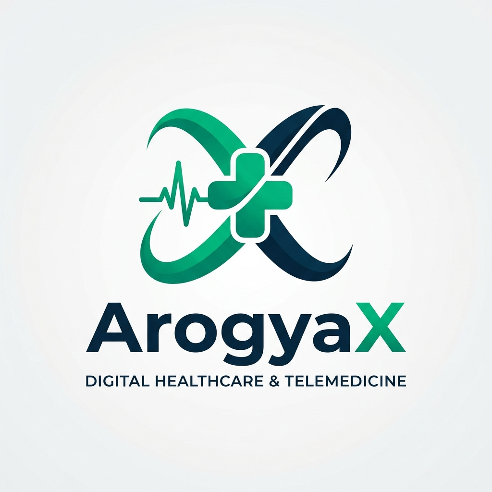

<p align="center">
  
</p>

<h1 align="center">ArogyaX — Advanced Hospital Management System</h1>

<p align="center">
  <b>AI-Powered Healthcare Platform · E-Pharmacy · Patient Vault · Telemedicine</b>
</p>

<p align="center">
  
  
  
  
  
</p>

---

## ✨ Overview

**ArogyaX** is a next-generation full-stack hospital management system. Built with Flask, MongoDB Atlas, and integrated with state-of-the-art AI, ArogyaX completely transforms the clinical workflow. It provides highly secure, role-based dashboards for **Patients**, **Doctors**, and **Admins**. 

With integrated **E-Pharmacy** ordering, a secure **Patient Vault**, professional PDF prescription generation, and AI-assisted diagnostics, ArogyaX acts as an all-in-one ecosystem for modern healthcare.

---

## 🚀 Key Workflows

### 🏥 The Patient Workflow
1. **Registration & Onboarding:** Patients create an account and access their personalized dashboard.
2. **Medical Vault:** Patients can seamlessly drag-and-drop their past medical history (Lab Reports, X-Rays, PDFs) into their private, secure Medical Vault.
3. **AI Diagnostics (Optional):** If a patient feels unwell, they can use the AI Symptom Checker or upload scans (Brain, Lung, Cataract) for an initial AI analysis powered by Gemini 2.5 Flash.
4. **Booking an Appointment:** The patient selects a medical specialization (e.g., Cardiologist) and books an open time slot.
5. **Telemedicine:** On the day of the appointment, the patient can launch a secure video call directly from their dashboard.
6. **E-Pharmacy:** Once the doctor prescribes medicine, a "Download PDF" and "Order Medicines" button appears instantly on the patient's dashboard, allowing them to order their medicines via our integrated Apollo Pharmacy portal.

### 🩺 The Doctor Workflow
1. **Dashboard & Schedule:** Doctors log into their portal to view a complete list of their upcoming and pending appointments.
2. **Appointment Approval:** Doctors review incoming requests and approve them.
3. **Reviewing Medical History:** Before seeing the patient, the doctor can click "View Records" to access the patient's personal Medical Vault and review their historical lab reports and X-rays.
4. **Consultation & Prescription:** After consulting (either via Video Call or in-person), the doctor clicks "Prescribe". They select the necessary medicines from a standardized list.
5. **Clinic-Grade PDF Generation:** Upon submitting the prescription, ArogyaX automatically generates a highly professional, clinic-grade PDF (complete with the clinic's letterhead, Rx symbol, and the doctor's signature) and sends it directly to the patient's dashboard.

---

## 🛠️ Tech Stack

| Layer | Technology |
|-------|-----------|
| **Backend** | Python 3.10+, Flask 3.0, Flask-Bcrypt, Flask-Mail |
| **Database** | MongoDB Atlas (PyMongo) |
| **AI / ML** | Google Gemini 2.5 Flash, Scikit-learn, Decision Trees |
| **Frontend** | HTML5, CSS3 (Glassmorphism UI), Vanilla JavaScript |
| **PDF Engine** | ReportLab (Advanced Tables & Styling) |
| **Authentication** | Flask Sessions + Bcrypt Hashing |

---

## ⚡ Quick Start

### Prerequisites
- **Python 3.10+** installed
- **MongoDB Atlas** account (free tier works perfectly)
- **Google Gemini API Key** (for AI Diagnostics)

### 1. Clone the Repository

```bash
git clone https://github.com/souvik/ArogyaX.git
cd ArogyaX
```

### 2. Create Virtual Environment

```bash
python -m venv venv
source venv/bin/activate        # macOS / Linux
# venv\Scripts\activate          # Windows
```

### 3. Install Dependencies

```bash
pip install -r requirements.txt
```

### 4. Configure Environment Variables

Create a `.env` file in the project root:

```env
# MongoDB Connection
MONGO_URI=mongodb+srv://<username>:<password>@<cluster>.mongodb.net/arogyax?retryWrites=true&w=majority

# Gemini AI API Key
GEMINI_API_KEY=your_gemini_api_key_here

# Flask Secret Key
SECRET_KEY=your_secure_secret_key
```

### 5. Run the Application

```bash
python app.py
```

Navigate to **[http://localhost:5001](http://localhost:5001)**

---

## 🔐 Demo Credentials

You can generate test data by visiting `/seed-demo` after starting the server. This will create the following test accounts:

| Role | Username | Password |
|------|----------|----------|
| **Admin** | `admin` | `admin123` |
| **Doctor** | `dr_anika` | `doctor123` |
| **Patient** | `john_patient` | `patient123` |
| **Patient** | `aman_patient` | `patient123` |

---

## 🤝 Contributing

Contributions are welcome! Please fork the repository and submit a pull request with your enhancements.

---

## 📄 License

This project is licensed under the [MIT License](LICENSE).

---

<p align="center">
  Developed by <b>Souvik</b>
</p>
