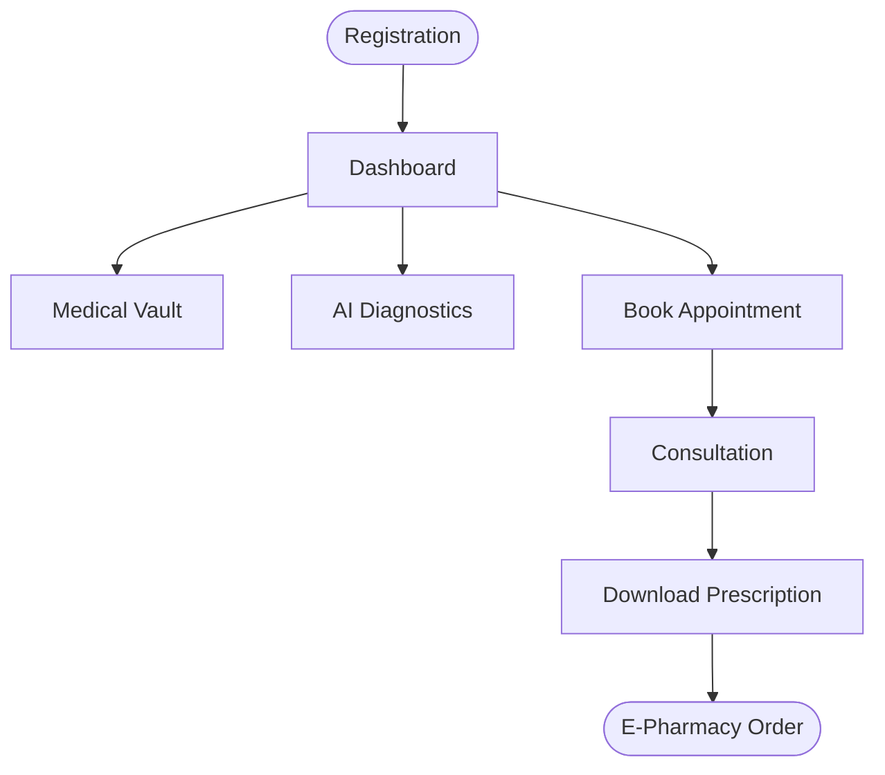
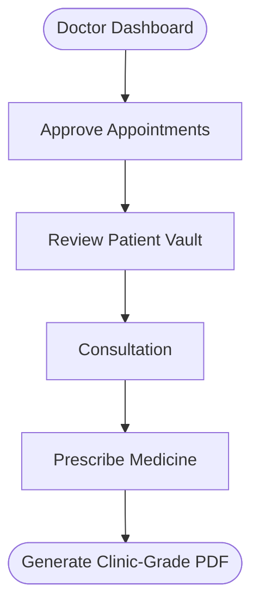

<p align="center">
  
</p>

<h1 align="center">ArogyaX — Hospital Management System</h1>

<p align="center">
  <b>AI-Powered Healthcare Platform · Disease Prediction · Medical Scan Analysis · Telemedicine</b>
</p>

<p align="center">
  
  
  
  
  
</p>

---

## ✨ Overview

**ArogyaX** is a full-stack, AI-powered hospital management system built with Flask and MongoDB Atlas. It provides role-based dashboards for **Patients**, **Doctors**, and **Admins**, along with cutting-edge AI features like symptom-based disease prediction, cataract/brain tumor/lung scan analysis, and an integrated telemedicine video call system.

> **Built for the GFG HackForHealth Hackathon** — Redefining the way we access healthcare.

---

## 🚀 Key Features

### 👤 Role-Based Access
| Role | Capabilities |
|------|-------------|
| **Patient** | Register, book appointments, view prescriptions, predict diseases, upload scans, video call |
| **Doctor** | Manage appointments, approve/prescribe, edit profile (bio, fees, availability, photo) |
| **Admin** | Full dashboard — view stats, manage all users, activate/deactivate accounts, delete users |

### 🤖 AI-Powered Diagnostics
- **Disease Prediction** — Select up to 5 symptoms → ML model (Decision Tree) predicts the disease with confidence score → Gemini 2.5 Flash provides a detailed medical explanation.
- **Brain Tumor Detection** — Upload MRI scan → Gemini Vision AI analyzes for tumors.
- **Lung Disease Detection** — Upload chest X-ray → AI-powered analysis and report.
- **Cataract Detection** — Upload eye image → AI identifies cataract indicators.

### 🏥 Appointment System
- Patients book appointments by selecting specialization & doctor.
- Doctors receive email notifications for new bookings.
- Doctors can **approve** appointments and **prescribe medicines** (auto-generated PDF).
- Patients can **download prescriptions** as PDF files.

### 📹 Telemedicine
- Built-in video call feature for remote consultations between patients and doctors.

### 📝 Health Blog
- Curated articles on healthcare topics: Holistic Health, Nutrition, Importance of Games, and more.

---

## 🚀 Key Workflows

### 🏥 The Patient Workflow



1. **Registration & Onboarding:** Patients create an account and access their personalized dashboard.
2. **Medical Vault:** Patients can seamlessly drag-and-drop their past medical history (Lab Reports, X-Rays, PDFs) into their private, secure Medical Vault.
3. **AI Diagnostics (Optional):** If a patient feels unwell, they can use the AI Symptom Checker or upload scans (Brain, Lung, Cataract) for an initial AI analysis powered by Gemini 2.5 Flash.
4. **Booking an Appointment:** The patient selects a medical specialization (e.g., Cardiologist) and books an open time slot.
5. **Telemedicine:** On the day of the appointment, the patient can launch a secure video call directly from their dashboard.
6. **E-Pharmacy:** Once the doctor prescribes medicine, a "Download PDF" and "Order Medicines" button appears instantly on the patient's dashboard, allowing them to order their medicines via our integrated Apollo Pharmacy portal.

### 🩺 The Doctor Workflow



1. **Dashboard & Schedule:** Doctors log into their portal to view a complete list of their upcoming and pending appointments.
2. **Appointment Approval:** Doctors review incoming requests and approve them.
3. **Reviewing Medical History:** Before seeing the patient, the doctor can click "View Records" to access the patient's personal Medical Vault and review their historical lab reports and X-rays.
4. **Consultation & Prescription:** After consulting (either via Video Call or in-person), the doctor clicks "Prescribe". They select the necessary medicines from a standardized list.
5. **Clinic-Grade PDF Generation:** Upon submitting the prescription, ArogyaX automatically generates a highly professional, clinic-grade PDF (complete with the clinic's letterhead, Rx symbol, and the doctor's signature) and sends it directly to the patient's dashboard.

---

## 🛠️ Tech Stack

| Layer | Technology |
|-------|-----------|
| **Backend** | Python 3.10+, Flask 3.0, Flask-Bcrypt, Flask-Mail |
| **Database** | MongoDB Atlas (PyMongo) |
| **AI / ML** | Google Gemini 2.5 Flash (genai SDK), Scikit-learn, TensorFlow, NumPy, Pandas |
| **Frontend** | HTML5, CSS3 (custom design system), Vanilla JavaScript |
| **PDF Generation** | ReportLab |
| **Authentication** | Flask sessions + Bcrypt password hashing |
| **Email** | Flask-Mail (Gmail SMTP) |

---

## 📁 Project Structure

```
Hospital Management System/
├── app.py                          # Main Flask application (all routes & logic)
├── requirements.txt                # Python dependencies
├── .env                            # Environment variables (API keys, DB URI)
├── .gitignore
├── LICENSE
│
├── static/
│   ├── css/style.css               # Complete design system & styles
│   ├── js/script.js                # Client-side interactions
│   ├── images/                     # Logos, illustrations, doctor photos
│   ├── Data/                       # ML training & testing CSVs
│   ├── uploads/profile_photos/     # Doctor profile photo uploads
│   └── prescriptions/              # Generated prescription PDFs
│
├── templates/                      # 24 Jinja2 HTML templates
│   ├── index.html                  # Landing page & patient dashboard
│   ├── login.html                  # Patient login
│   ├── patient-register.html       # Patient registration
│   ├── patient-profile.html        # Patient profile & appointments
│   ├── patient-dashboard.html      # Patient dashboard
│   ├── book-appointment.html       # Appointment booking with doctor cards
│   ├── doctor-register.html        # Doctor registration
│   ├── doctor-dashboard.html       # Doctor dashboard
│   ├── doctor-patients.html        # Doctor's patient list
│   ├── doctor-profile-edit.html    # Doctor profile editor
│   ├── doctors.html                # Public doctor directory
│   ├── prescribe-medicine.html     # Prescription form
│   ├── admin-login.html            # Admin login portal
│   ├── admin.html                  # Admin dashboard
│   ├── disease_predict.html        # AI disease prediction
│   ├── brain-tumor.html            # Brain tumor scan analysis
│   ├── lung.html                   # Lung disease scan analysis
│   ├── cataract.html               # Cataract detection
│   ├── videocall.html              # Telemedicine video call
│   ├── privacy-policy.html         # Privacy policy
│   └── blog_*.html                 # Health blog articles
│
└── notebooks/                      # Jupyter notebooks (research & training)
    ├── disease-prediction/
    ├── brain_tumor_detection.ipynb
    ├── lung-cancer-prediction/
    └── pneumonia-prediction/
```

---

## ⚡ Quick Start

### Prerequisites
- **Python 3.10+** installed
- **MongoDB Atlas** account ([free tier](https://cloud.mongodb.com))
- **Google Gemini API Key** ([get free key](https://aistudio.google.com/app/apikey))

### 1. Clone the Repository

```bash
git clone https://github.com/souvik082003/ArogyaX.git
cd ArogyaX
```

### 2. Create Virtual Environment

```bash
python -m venv venv
source venv/bin/activate        # macOS / Linux
# venv\Scripts\activate          # Windows
```

### 3. Install Dependencies

```bash
pip install -r requirements.txt
```

### 4. Configure Environment Variables

Create a `.env` file in the project root:

```env
# MongoDB Atlas Connection
MONGO_URI=mongodb+srv://<username>:<password>@<cluster>.mongodb.net/arogyax?retryWrites=true&w=majority

# Google Gemini AI API Key
GEMINI_API_KEY=your_gemini_api_key_here

# Flask Secret Key
SECRET_KEY=your_secret_key_here

# Gmail SMTP (optional, for email notifications)
MAIL_USERNAME=your_email@gmail.com
MAIL_PASSWORD=your_app_password
MAIL_DEFAULT_SENDER=your_email@gmail.com
```

> ⚠️ **Note:** If your MongoDB password contains special characters like `@`, URL-encode them (e.g., `@` → `%40`).

### 5. Run the Application

```bash
python app.py
```

### 6. Open in Browser

Navigate to **[http://localhost:5000](http://localhost:5000)**

> 💡 **macOS Users:** If port 5000 is blocked, disable **AirPlay Receiver** in System Settings → General → AirDrop & AirPlay.

---

## 🔐 Demo Credentials

Seed the demo data by visiting `/seed-demo` after starting the server, then use:

| Role | Username | Password |
|------|----------|----------|
| **Admin** | `admin` | `admin123` |
| **Doctor** | `dr_anika` | `doctor123` |
| **Doctor** | `dr_rahul` | `doctor123` |
| **Doctor** | `dr_priya` | `doctor123` |
| **Patient** | `john_patient` | `patient123` |
| **Patient** | `priti_patient` | `patient123` |
| **Patient** | `karan_patient` | `patient123` |
| **Patient** | `sara_patient` | `patient123` |

---

## 🩺 API Endpoints

| Method | Route | Description |
|--------|-------|-------------|
| `GET` | `/` | Landing page / Patient dashboard |
| `GET/POST` | `/login` | Patient login |
| `GET/POST` | `/patient-register` | Patient registration |
| `GET/POST` | `/doctor-register` | Doctor registration |
| `GET/POST` | `/admin-login` | Admin login portal |
| `GET` | `/admin-dashboard` | Admin control panel |
| `GET/POST` | `/book-appointment` | Book an appointment |
| `GET/POST` | `/disease-predict` | AI disease prediction |
| `GET/POST` | `/brain-tumor` | Brain tumor scan analysis |
| `GET/POST` | `/lung` | Lung disease scan analysis |
| `GET/POST` | `/cataract` | Cataract detection |
| `GET` | `/doctors` | Public doctor directory |
| `GET/POST` | `/doctor-profile-edit` | Doctor profile editor |
| `GET` | `/doctor-patients` | Doctor's appointment list |
| `GET` | `/videocall` | Telemedicine video call |
| `GET` | `/profile` | Patient profile |
| `GET` | `/api/health` | Health check endpoint |
| `GET` | `/seed-demo` | Seed demo data |

---

## 🧠 AI Models

### Disease Prediction (ML)
- **Algorithm:** Decision Tree Classifier (Scikit-learn)
- **Training Data:** 132 symptoms → 41 diseases
- **Accuracy:** Trained on curated medical dataset with cross-validation
- **Enhancement:** Gemini 2.5 Flash provides human-readable explanations for each prediction

### Medical Scan Analysis (Vision AI)
- **Engine:** Google Gemini 2.5 Flash with Vision capabilities
- **Supported Scans:** Brain MRI, Chest X-ray, Eye images
- **Output:** Detailed analysis with findings, severity assessment, and recommendations

---

## 🤝 Contributing

Contributions are welcome! Please follow these steps:

1. Fork the repository
2. Create a feature branch (`git checkout -b feature/amazing-feature`)
3. Commit your changes (`git commit -m 'Add amazing feature'`)
4. Push to the branch (`git push origin feature/amazing-feature`)
5. Open a Pull Request

---

## 📄 License

This project is licensed under the [MIT License](LICENSE).

---

<p align="center">
  Made with ❤️ by <b>Souvik</b>
</p>
